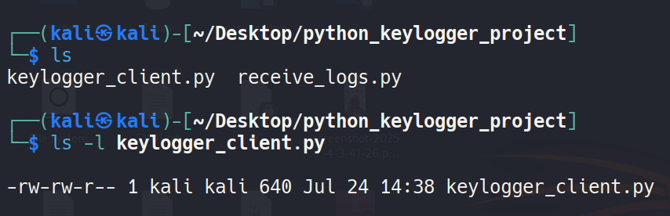
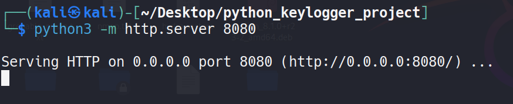
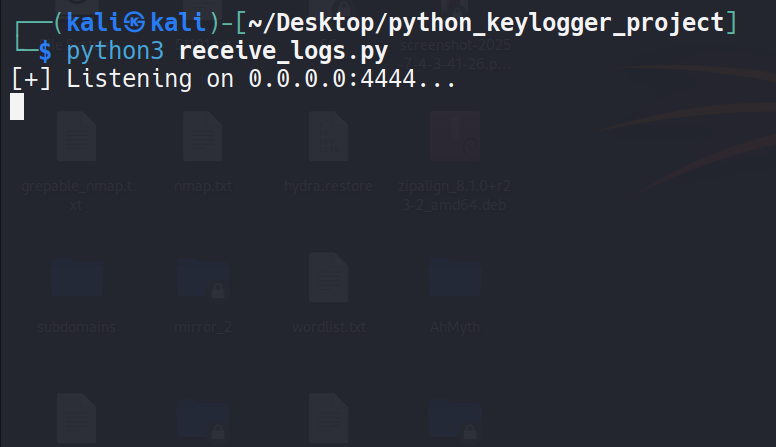
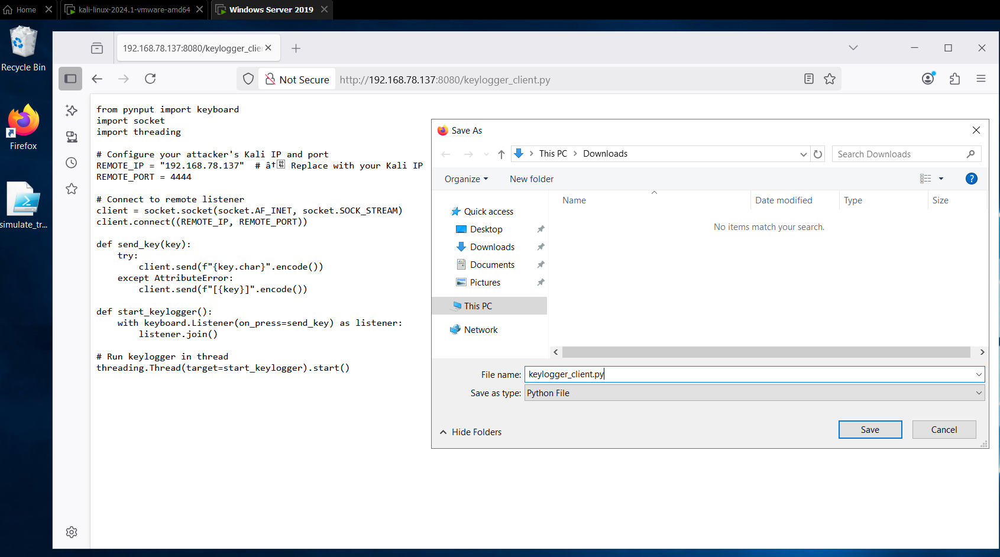
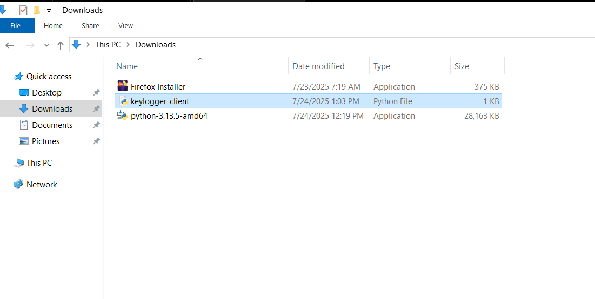
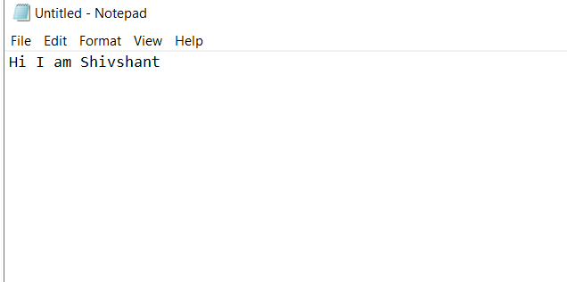
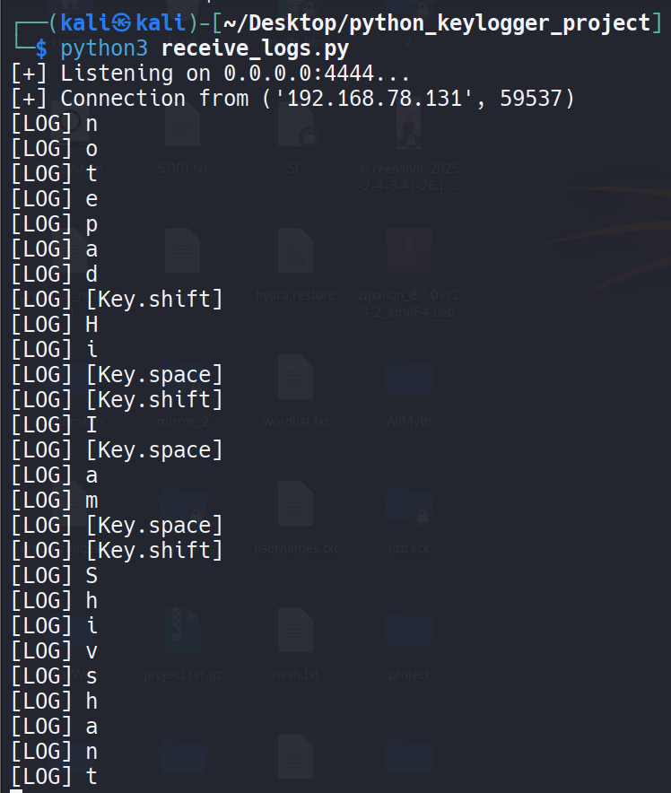

# 🛡️ Python-Based Keylogger for Security Awareness
_A demo tool to understand real-world keylogging techniques in a controlled lab setup_


This project demonstrates how attackers use keyloggers to capture sensitive keystrokes using simple Python scripts. It is built **for educational purposes only**, to help understand the risks posed by such tools in real-world environments.

> ⚠️ **DISCLAIMER:** This keylogger is intended for use **only in a safe, controlled lab setup** with systems you own. Unauthorized deployment of this tool may be illegal and unethical.

---

## 📌 Features

- Captures keystrokes on a Windows machine
- Sends logs to an attacker's Kali machine via TCP socket (port 4444)
- Demonstrates real-time exfiltration of input
- Shows delivery via HTTP using a Python HTTP server
- Can be compiled to `.exe` using PyInstaller for realistic simulation

---

## 🧰 Tools & Technologies

- `Python 3`
- `pynput` (for key logging)
- `socket` (for communication)
- `PyInstaller` (to convert `.py` to `.exe`)
- `Windows Server 2019` (victim machine)
- `Kali Linux` (attacker machine)

---

## 🔗 Quick Access

- [📝 keylogger_client.py](keylogger_client.py)
- [📝 receive_logs.py](receive_logs.py)
- [📂 screenshots/](screenshots)

---

## 🖥️ Project Demo Screenshots

| Stage | Screenshot |
|-------|------------|
| ✅ Keylogger source files on Kali |  |
| ✅ HTTP server setup on Kali |  |
| ✅ Listener running on Kali (port 4444) |  |
| ✅ Victim downloads the Python file |  |
| ✅ Victim opens the EXE |  |
| ✅ Victim types in Notepad |  |
| ✅ Keystrokes received on Kali |  |

---

## ⚙️ How It Works

1. **Attacker runs** `receive_logs.py` on Kali to listen on port 4444.
2. **Victim downloads** `keylogger_client.exe` via browser (hosted by Kali’s HTTP server).
3. When the **victim runs the keylogger**, it connects back to the attacker's machine.
4. All keystrokes typed on the victim system are sent to Kali in real-time.

---

## 🔧 Setup Guide

### ✅ On Kali (Attacker):

```bash
# Start TCP listener
python3 receive_logs.py

# (Optional) Start HTTP server to host payload
python3 -m http.server 8080
```

---

### ✅ On Windows (Victim):

1. Download the `.exe` from Kali via browser
2. Run the executable (or compile from `.py` using PyInstaller)
3. Start typing anywhere (e.g., Notepad)
4. Observe logs appearing live on Kali

---

## 🧪 Compile to EXE (Optional)

On Windows, convert `.py` to `.exe` with:

```bash
pip install pyinstaller
pyinstaller --onefile --noconsole keylogger_client.py
```

Output will be in the `dist/` folder.

---

## 📂 Project Structure

```
keylogger-project/
├── keylogger_client.py
├── receive_logs.py
├── README.md
├── screenshots/
│   ├── 1-kali-keylogger-source.png
│   ├── 2-kali-http-server.png
│   ├── 3-kali-receive-logs.png
│   ├── 4-victim-save-as.png
│   ├── 5-victim-opens-file.png
│   ├── 6-victim-typing.png
│   └── 7-kali-keystrokes-received.png
```

---

## ⚖️ License

This project is licensed under the [MIT License](https://opensource.org/licenses/MIT). Use responsibly.

---

## 🙋‍♂️ Author

**Shivshant Patil**  
Cybersecurity Enthusiast | CEH (v13) | Python & Linux | Ethical Hacking Labs

📧 shivshantp007@gmail.com  
🔗 [LinkedIn](https://www.linkedin.com/in/shivshant-patil-b58aaa281)

---

> 💡 *This project is built to raise awareness about the power and risks of keyloggers. Always use such tools responsibly and ethically.*
